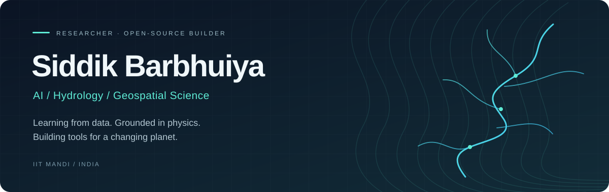
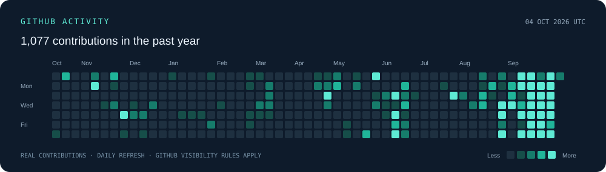

<!-- Profile: github.com/Barbhuiya12. Banner is hosted in this repository. -->

  

  <b>PhD Researcher at IIT Mandi</b> &nbsp;·&nbsp; AI–Hydrology &nbsp;·&nbsp; Open-source geospatial tools

  

  <a href="https://barbhuiya12.github.io/">Portfolio</a> &nbsp; / &nbsp;
  <a href="https://scholar.google.com/citations?user=W1pyDYAAAAAJ&amp;hl=en">Google Scholar</a> &nbsp; / &nbsp;
  <a href="https://orcid.org/0000-0003-1278-5151">ORCID</a> &nbsp; / &nbsp;
  <a href="https://www.linkedin.com/in/siddik-barbhuiya-65888871/">LinkedIn</a> &nbsp; / &nbsp;
  <a href="mailto:siddikbarbhuiya@gmail.com">Email</a>

  <a href="#research">Research</a> &nbsp;·&nbsp;
  <a href="#selected-projects">Projects</a> &nbsp;·&nbsp;
  <a href="#selected-publications">Publications</a> &nbsp;·&nbsp;
  <a href="#toolbox">Toolbox</a> &nbsp;·&nbsp;
  <a href="#lets-collaborate">Collaborate</a>

---

### Bridging the physics of water and the power of AI

I’m **Siddik Barbhuiya**, a PhD researcher at the **Indian Institute of Technology Mandi**, working at the intersection of hydrology, machine learning, and geospatial data science.

My research explores how we can build models that learn from observations while respecting physical processes—from rainfall–runoff prediction to climate extremes. Alongside research, I build open-source tools that make scientific data easier to inspect, analyse, and trust.

**Currently exploring:** differentiable land-surface modelling for India, deep learning for ungauged basins, and reliable geospatial AI workflows.

## Selected projects

  
  
  

<table>
  <tr>
    <td width="50%" valign="top">
      <h3>01 &nbsp; GeoSplit Guard</h3>
      
<b>Trust your split. Inspect the evidence.</b>

      
A local auditor for geospatial image datasets. Inspect cross-split duplicates, partial geographic overlaps, and shared scenes before training.

      
Python · Rasterio · Shapely · Local review interface

      
<a href="https://github.com/Barbhuiya12/geosplit-guard"><b>Explore the project →</b></a>

    </td>
    <td width="50%" valign="top">
      <h3>02 &nbsp; DuckGIS</h3>
      
<b>Spatial data workflows inside QGIS.</b>

      
A DuckDB spatial studio and cloud GeoParquet engine for QGIS, connecting geospatial exploration with analytical data workflows.

      
Python · QGIS · DuckDB · GeoParquet

      
<a href="https://github.com/Barbhuiya12/DuckGIS"><b>Explore the project →</b></a>

    </td>
  </tr>
  <tr>
    <td width="50%" valign="top">
      <h3>03 &nbsp; Flood Resource</h3>
      
<b>A starting point for flood research.</b>

      
Open datasets, processing scripts, reference materials, and tools for flood modelling, mapping, and hydrological analysis.

      
Jupyter · Hydrology · Geospatial resources

      
<a href="https://github.com/Barbhuiya12/Flood_Resource"><b>Browse the resources →</b></a>

    </td>
    <td width="50%" valign="top">
      <h3>04 &nbsp; AI4DRM</h3>
      
<b>AI for disaster risk management.</b>

      
Research notebooks for investigating flood, landslide, and cloudburst hazards through AI and remote-sensing workflows.

      
Jupyter · Remote sensing · Hazard analytics

      
<a href="https://github.com/Barbhuiya12/AI4DRM"><b>Explore the notebooks →</b></a>

    </td>
  </tr>
</table>

Also explore [Hydrology notebooks](https://github.com/Barbhuiya12/Hydrology-), [Python visualisation](https://github.com/Barbhuiya12/Visualization-With-python), and my [academic portfolio source](https://github.com/Barbhuiya12/Barbhuiya12.github.io).

## Research

| Direction | Questions I explore |
| --- | --- |
| **Differentiable hydrology** | How can neural networks and differentiable physical models work together without losing interpretability? |
| **Rainfall–runoff learning** | How can deep learning generalise across Indian catchments, including ungauged basins? |
| **Climate extremes** | What do CMIP6 projections and nonstationary flood analysis tell us about future water risks? |
| **Geospatial hazard analytics** | How can satellite observations, gauges, and modelling support flood, landslide, and cloudburst analysis? |

My work includes hybrid physics–ML frameworks such as **MILC-δ**, continental-scale rainfall–runoff modelling, and hydroclimate analysis across India and the Himalayas.

## Selected publications

- **2026 · Differentiable hydrology** — [Differentiable, Learnable MILC: Balancing Predictive Skill and Physical Interpretability](https://meetingorganizer.copernicus.org/EGU26/EGU26-16119.html), *EGU General Assembly*.
- **2026 · Climate projections** — [Projections of Future Streamflow for India Informed by CMIP6 GCMs](https://doi.org/10.1002/hyp.70476), *Hydrological Processes*.
- **2025 · Ungauged basins** — [From Gauged to Ungauged: Large-Scale Deep Learning Rainfall–Runoff Modelling for India](https://www.sciencedirect.com/science/article/pii/S1364815225003809), *Environmental Modelling & Software*.
- **2024 · Model evaluation** — [Performance Evaluation of Machine Learning in Hydrology: SWAT vs GR4J vs Deep Learning](https://doi.org/10.1007/s12040-024-02340-0), *Journal of Earth System Science*.

<b>More publications & conference work</b>

 

| Year | Work | Venue |
| :---: | --- | --- |
| 2026 | [Hydro-meteorological & Infrastructural Damage Analysis of the Ramban Cloudburst (J&K)](https://www.sciencedirect.com/science/article/pii/S221242092600138X) | International Journal of Disaster Risk Reduction |
| 2025 | [Climate-Change Impacts on Beas River Basin Hydroclimate](https://doi.org/10.1007/978-3-031-76532-2_14) | Springer book chapter |
| 2023 | [Streamflow in Ungauged Basins via Physical Similarity](https://doi.org/10.1007/s12517-023-11786-3) | Arabian Journal of Geosciences |
| 2023 | Nonstationary Flood Frequency Analysis: Review of Methods & Models | Springer book chapter |
| 2021 | [Lumped Conceptual Rainfall–Runoff Genie Rural Models for Streamflow](https://doi.org/10.1007/978-981-19-9147-9_22) | Springer · HYDRO 2021 |

Additional conference contributions at **AGU Fall Meetings** and **EGU General Assemblies**. Publication labels above are shortened for readability; see the linked records for full bibliographic details.

[View my publication record on Google Scholar →](https://scholar.google.com/citations?user=W1pyDYAAAAAJ&hl=en)

## Toolbox

| Layer | Tools |
| --- | --- |
| **Scientific computing** | Python · R · NumPy · pandas · xarray · Jupyter |
| **Machine learning** | PyTorch · JAX · TensorFlow · scikit-learn · NeuralHydrology |
| **Earth & spatial data** | QGIS · Google Earth Engine · ArcGIS · Rasterio · NetCDF · CDO |
| **Hydrological modelling** | SWAT · GR4J · VIC · WRF |
| **Development** | Git · Linux · Docker · Bash · LaTeX |

## Built for the research community

- **[ICCDRH](https://research.iitmandi.ac.in/iccdrh/)** — International Conference on Climate, Disaster Risk & Hydrology. Conference website work for the IIT Mandi research community.
- **[INCLINE](https://incline.iitmandi.ac.in)** — Indian Climate Information Explorer. Climate information and tools for adaptation, resilience, and community engagement.
- **[Academic portfolio](https://barbhuiya12.github.io/)** — A closer look at my research, publications, and projects.

## GitHub Activity

  

Real contribution history from GitHub, refreshed daily. Counts reflect GitHub’s contribution rules and profile visibility—not every commit. [Explore my activity →](https://github.com/Barbhuiya12?tab=overview)

## Let’s collaborate

I’m interested in **research collaborations, open-source hydrology, scientific machine learning, and geospatial tools**. If you’re working on water, climate, or trustworthy Earth-system AI, I’d love to connect.

**[Email me](mailto:siddikbarbhuiya@gmail.com)** &nbsp;·&nbsp; [LinkedIn](https://www.linkedin.com/in/siddik-barbhuiya-65888871/) &nbsp;·&nbsp; [ResearchGate](https://www.researchgate.net/profile/Siddik-Barbhuiya) &nbsp;·&nbsp; [ORCID](https://orcid.org/0000-0003-1278-5151)

---

  <b>Models that respect the physics of water—and learn from its data.</b> 
  Made with curiosity in Mandi, India.

